# 🐍 Python Mastery Notes by 

<p align="center">
  
</p>

<p align="center">
  <b>Empowering the next generation of Python Developers with industry-standard resources.</b>
</p>

<p align="center">
  <a href="https://www.python.org/"></a>
  <a href="https://github.com/doxpro26-star/Python_notes_byDoxpro/stargazers"></a>
  <a href="https://github.com/doxpro26-star/Python_notes_byDoxpro/network/members"></a>
  <a href="https://opensource.org/licenses/MIT"></a>
</p>

---

## 📋 Table of Contents
- [📖 Overview](#-overview)
- [🌟 Why DoxPro Notes?](#-why-doxpro-notes)
- [🛤️ Learning Roadmap](#%EF%B8%8F-learning-roadmap)
- [🗂️ Module Breakdown](#%EF%B8%8F-module-breakdown)
- [🚀 Quick Start Guide](#-quick-start-guide)
- [🛡️ Contribution & Support](#%EF%B8%8F-contribution--support)
- [🔗 Connect with Us](#-connect-with-us)

---

## 📖 Overview

Welcome to the **Ultimate Python Mastery Path**! 🚀 This repository isn't just a collection of notes; it's a strategically designed curriculum by **DoxPro** to bridge the gap between academic learning and professional excellence. 

From the basic "Hello World" to complex data structures and interview-specific logic, every document is crafted to ensure you don't just *learn* Python, you *master* it.

---

## 😃 Why DoxPro Notes?

| Feature | Benefit |
| :--- | :--- |
| **Zero to Hero** | No prior coding experience required. We start from scratch. |
| **Logic Building** | Focuses on *how* to think like a developer, not just syntax. |
| **Interview Ready** | Includes patterns and questions asked by top-tier tech companies. |
| **Hands-on Tasks** | Practical exercises attached to every major topic. |

---

## 🛤️ Learning Roadmap

We follow a modular approach to ensure deep conceptual understanding. Here is the path you will take:

```mermaid
graph TD
    A[💖Level 1: Fundamentals] -- Basics & Unicode --> B[🧵 Level 2: Strings & Ops]
    B -- Slicing & Methods --> C[🔀 Level 3: Control Flow]
    C -- Conditions & Loops and its tasks --> *[✨patterns ]
    * --  star patters for logic building --> D[ Level 4: Data Structures]
    D -- Collections --> E[⚙️ Level 5: Functions]
    E -- Modularity --> F[📝 Level 6: Interview Mastery]
    F --> G{for ML Ready}
    
    style G fill:#f9f,stroke:#333,stroke-width:4px
```



---

## ✔ Module Breakdown

Explore each chapter of your journey:

### 🔹 Module 1: The Building Blocks
- **[Python_Print_Unicode.docx](./Python_Print_Unicode.docx)**: The core of output and encoding.
- **[Python_String_Notes_DoxPro.docx](./Python_String_Notes_DoxPro.docx)**: Mastering the most used data type.

### 🔹 Module 2: Logic & Control
- **[Python_IfElse_Break_Continue.docx](./Python_IfElse_Break_Continue.docx)**: Making decisions and controlling execution flow.
- **[Python_Collections_Loops.docx](./Python_Collections_Loops.docx)**: Handling groups of data efficiently.
- **[Python_Loops_Tasks_DoxPro.docx](./Python_Loops_Tasks_DoxPro.docx)**: Practical exercises to master loops and iterations.
- **[Python_StarPatterns_DoxPro.docx](./Python_StarPatterns_DoxPro.docx)**: Logic building through various star pattern challenges.

### 🔹 Module 3: Advanced Abstraction
- **[Python_Functions_DoxPro.docx](./Python_Functions_DoxPro.docx)**: Code reusability and modular design.
- **[Python_Functions_Tasks_DoxPro.docx](./Python_Functions_Tasks_DoxPro.docx)**: Putting your function knowledge to the test.

### 🔹 Module 4: Career Preparation
- **[Python_Interview_QA_v2.docx](./Python_Interview_QA_v2.docx)**: A goldmine of curated questions to crack any technical round.
- **[Python_Notes_DoxPro (1).docx](./Python_Notes_DoxPro%20(1).docx)**: Quick reference summaries for rapid revision.

---

## �️ Project Structure & Resources

| Category | Description | Resource Link |
| :--- | :--- | :--- |
| **🚀 Fundamentals** | Basics, Print, and Unicode handling | [View Document](./Python_Print_Unicode.docx) |
| **🧵 String Mastery** | Slicing, methods, and manipulation | [View Document](./Python_String_Notes_DoxPro.docx) |
| **🔀 Control Flow** | If-Else, Break, and Continue logic | [View Document](./Python_IfElse_Break_Continue.docx) |
| **📊 Data Structures** | Lists, Tuples, Sets, and Dictionaries | [View Document](./Python_Collections_Loops.docx) |
| **🔄 Loops & Logic** | **Loop Tasks** and Star Pattern challenges | [Tasks](./Python_Loops_Tasks_DoxPro.docx) \| [Patterns](./Python_StarPatterns_DoxPro.docx) |
| **⚙️ Functions** | Modular programming and reusability | [Notes](./Python_Functions_DoxPro.docx) \| [Tasks](./Python_Functions_Tasks_DoxPro.docx) |
| **💼 Interview Prep** | Industry-standard Q&A and core notes | [QA](./Python_Interview_QA_v2.docx) \| [Summary](./Python_Notes_DoxPro%20(1).docx) |

---

## 🚀 Quick Start Guide

To get the most out of these resources, follow this recommended setup:

1. **Clone & Setup:**
   ```bash
   git clone https://github.com/doxpro26-star/Python_notes_byDoxpro.git
   cd Python_notes_byDoxpro
   ```

2. **Environment Ready:**
   Make sure you have Python 3.x installed. You can check via:
   ```bash
   python --version
   ```

3. **Suggested Study Pattern:**
   - Read the `.docx` file for a concept.
   - Open a code editor (VS Code / PyCharm).
   - Manually type and execute the examples to build muscle memory.
   - Complete the **Tasks** file for that module.

---

## 🛡️ Contribution & Support

We believe in the power of community! 🌍

*   Found a typo? **Submit a Pull Request.**
*   Have a suggestion? **Open an Issue.**
*   Loved the notes? **Give us a ⭐!**

---

## ❤️ Connect with Us

Stay updated with more resources and robotics projects from **DoxPro**:

<p align="left">
  <a href="https://www.doxprorobotics.in"></a>
  <a href="https://www.linkedin.com/company/doxpro"></a>
  <a href="https://github.com/doxpro26-star"></a>
</p>

---

<p align="center">
  
  <i>Crafting Excellence in Python & Robotics • <b>DoxPro</b> • 2026</i>
</p>
